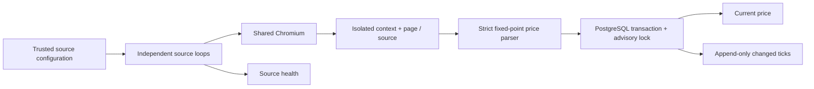

# Market Price Watcher — architecture and design boundaries

The standalone source code is **new generic implementation informed by**
Zarnoush's private price-watcher architecture. It does **not** publish
Zarnoush source credentials, selectors, hostnames, customer data, session
cookies, market-feed agreements, or proprietary database models.



## Key decisions

- **Browser lifetime:** One shared browser process; an isolated context and a
  persistent page for each source. Polling does not refresh the page if healthy;
  a failed reader closes its context and reloads on recovery.
- **Configuration:** Explicit trusted operator-provided sources, not public
  user-submitted URL fetching. HTTPS required by default, loopback HTTP only
  with `allowLocalhost:true` for controlled fixtures.
- **Network boundary:** Browser request routes reject non-origin requests.
  This is **not** full SSRF protection (DNS rebinding, proxy, IPv6/private
  routing, redirects and the deployment network still require controls).
  DO NOT expose source configuration to untrusted users.
- **Money:** Decimal text represented via integer subunits. Input validation
  rejects malformed grouping and ambiguous values; no floating-point price
  calculations. Postgres `NUMERIC(24,2)` preserves stored precision.
- **Concurrency:** Transaction-scoped advisory lock on (source,instrument),
  followed by a row lock. Multiple watchers cannot write a stale price over
  a newer timestamp. Identical prices refresh last-seen time without adding
  an unnecessary history tick.
- **Health:** Per-source OK, error, stopped and consecutive-failure counters.
  No raw page HTML, credentials or sensitive sessions are logged.
- **Retry:** Exponential capped backoff + jitter, with separate independent
  source loops and abortable sleeps.
- **Testing:** Standard-library unit tests, a real local Chromium fixture that
  mutates the DOM without navigation, and PostgreSQL concurrency tests against
  a disposable PostgreSQL 16 service.

## Scope restrictions

- **No website-specific authentication module**, CAPTCHA automation or stealth
  techniques. Authentication and terms are specific to each provider and need
  explicit permission plus a carefully audited credential strategy.
- **No generic remote configuration API.** The sample is intentionally NOT
  exposed as an arbitrary-URL scraping service.
- **No guaranteed financial-grade correctness.** There are no exchange rate,
  currency conversion, market-hours, data provenance or financial compliance
  guarantees. A separate production ingestion service needs policy controls,
  alerting, backups, auditability and testing with realistic traffic.
- **No production-grade scheduler coordination across replicas.** Competing
  writers converge safely in PostgreSQL, but distributed scheduling / leader
  election is outside this reference implementation.
- **No secrets in Git.** A .env.example contains only local placeholder values.
  Local sessions are ephemeral and not written to disk.

## Tests and honest evidence

```bash
npm install
npx playwright install chromium
npm run typecheck
npm run migrate # only against disposable test DB
npm test
```

The browser tests run on a local fixture; they do not exercise any third-party
site. No real website is scraped in CI. Benchmarks or claims about price update
latency/throughput require a separate workload and measured environment.

## Production design improvements

1. Add a centrally managed source configuration and per-source authorization.
2. Apply DNS/IP egress restrictions and network segmentation.
3. Encrypt persisted browser state if authentication is introduced.
4. Split ingestion events from normalized price/domain decision-making.
5. Add retention, alerting, dead-letter/quarantine and operator recovery UX.
6. Move to explicit decimal scale/currency per instrument rather than
   assuming two decimal places globally.
7. Test performance under load, process shutdown while queries are blocked,
   and failure recovery across replicated workers.
